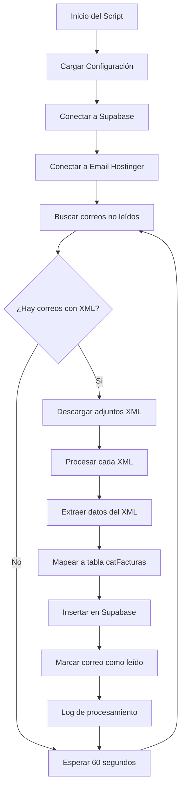

# Arquitectura del Sistema de Procesamiento de Facturas

## Overview
Sistema para procesar automáticamente correos electrónicos con archivos XML de facturas, extraer la información y almacenarla en una base de datos Supabase.

## Estructura del Proyecto
```
facturas_processor/
├── src/
│   ├── __init__.py
│   ├── config.py              # Configuración de credenciales
│   ├── supabase_client.py     # Conexión a Supabase
│   ├── email_client.py        # Conexión IMAP con Hostinger
│   ├── xml_parser.py          # Parser de XML de facturas
│   ├── factura_mapper.py      # Mapeo XML a tabla catFacturas
│   ├── processor.py           # Lógica principal de procesamiento
│   └── logger.py              # Sistema de logging
├── requirements.txt            # Dependencias de Python
├── .env                       # Archivo de variables de entorno (credenciales)
├── .env.example              # Plantilla de archivo .env
├── main.py                    # Script principal
└── README.md                  # Documentación
```

## Flujo de Procesamiento



## Dependencias Principales
- **imaplib**: Conexión IMAP con servidor de correo
- **email**: Procesamiento de correos electrónicos
- **xml.etree.ElementTree**: Parseo de archivos XML
- **supabase-py**: Cliente de Supabase para Python
- **python-dotenv**: Manejo de variables de entorno
- **schedule**: Para el sistema de monitoreo continuo

## Mapeo de Datos XML a catFacturas

Basado en la estructura de la tabla y los ejemplos proporcionados, el sistema extraerá:

- **idFactura**: UUID del CFDI
- **uuidCFDI**: UUID del CFDI (mismo campo)
- **folioCFDI**: Folio del comprobante
- **fecCFDI**: Fecha de emisión del CFDI
- **totalCFDI**: Total de la factura
- **subtotalCFDI**: Subtotal
- **moneda**: Moneda (generalmente MXN)
- **rfcEmisor**: RFC del emisor
- **nombreEmisor**: Nombre del emisor
- **regimenFiscal**: Régimen fiscal del emisor
- **descripcion**: Resumen formateado de la factura
- **concepto**: Descripción principal del concepto
- **mesFactura**: Mes extraído de la fecha
- **anioCFDI**: Año de la factura
- **selloSAT**: Sello del SAT
- **noCertificadoSAT**: Número de certificado del SAT

## Características de Seguridad y Robustez

- Manejo de errores con reintentos automáticos
- Logging detallado de todas las operaciones
- Validación de datos antes de insertar en Supabase
- Detección de duplicados por UUID
- Configuración externa de credenciales
- Monitoreo continuo con intervalos configurables

## Configuración Requerida

El sistema necesitará las siguientes credenciales en el archivo `.env`:
```
# Configuración de correo IMAP
IMAP_SERVER=imap.hostinger.com
IMAP_PORT=993
IMAP_USER=tu_correo@dominio.com
IMAP_PASSWORD=tu_contraseña

# Configuración de Supabase
SUPABASE_URL=https://tu-proyecto.supabase.co
SUPABASE_KEY=tu_clave_api

# Configuración del procesador
POLLING_INTERVAL=60
LOG_LEVEL=INFO
```

## Estructura de XML Esperada

El sistema procesará archivos XML de CFDI con la siguiente estructura:
- Comprobante: Datos generales del CFDI
- Emisor: Información del emisor
- Receptor: Información del receptor
- Conceptos: Detalle de los conceptos facturados
- Impuestos: Información fiscal
- Complemento: Timbre fiscal digital (TFD)

## Manejo de Errores

- Reintentos automáticos en caso de fallos de conexión
- Logging de errores para diagnóstico
- Continuación del procesamiento ante errores individuales
- Notificación de errores críticos